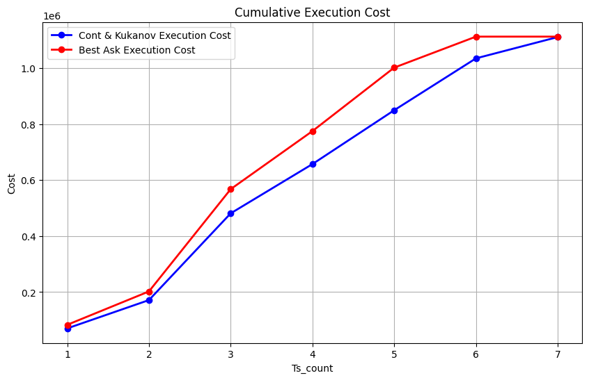

# Cont & Kukanov Smart Order Router
The model is trying to solve how to allocate an big order into different venues with minimal cost that is better than naive "best-ask" way, by saying that cost is equal to: 
$$\text{Total Cost} = \text{Cash Paid} + \lambda_u \cdot \text{Underfill} + \lambda_o \cdot \text{Overfill} + \theta \cdot (\text{Underfill} + \text{Overfill})$$

## Mock Data
Since there is only one publisher id (venue) in csv, we need to **mock data** to simulate slightly different ask size and ask price in different venues. I use ```searchsorted``` to get current price's quantitle index, and add some random fluctuation in both ```ask_px``` and ```ask_sz``` to get situation like real market

This ensures that our allocator can find a better allocation than the naive **"best-ask" only** method,  
because the allocator will jump out some expensive ask price in certain venue.

```python
def mock_venue_data(row, n_venues, price_quantile, fee_step, rebate_step):
    venues = []
    for i in range(n_venues):
        idx = np.searchsorted(price_quantile, row['ask_px_00'])
        idx_shift = np.random.randint(-10, 10)
        new_idx = np.clip(idx + idx_shift, 0, len(price_quantile) - 1)
        
        venue = {
            'ask_px': round(price_quantile[new_idx]* np.random.uniform(0.99, 1.01), 2),
            'ask_sz': max(1, int(row['ask_sz_00'] * np.random.uniform(0.8, 1.5))),
            'fee': fee_step[i],
            'rebate': rebate_step[i],
        }
        venues.append(venue)

    return venues
```

* The rebate and fee range used for simulation is based on ```rebate_range, fee_range = [0.002, 0.0008], [0.003, 0.0015]``` after online searching for AAPL stock, and there are about 10 venues for trading AAPL so we set ```n_venues = 10```

## Feature
### Parameter Range
 - Based on theCont & Kukanov's paper, I put parameter range into:
``` λ_over_range = np.linspace(0.002, 0.01, 5)
    λ_under_range = np.linspace(0.002, 0.01, 5)
    θ_range = np.linspace(0.002, 0.01, 5)
```
After that, a grid search will be applied during every allocation, and keep updating the ```best_params``` variable when we reach the ```min_cost``` based on cost computing function

### Overfill 
To simplify it, this backtest don't allow overfill by stating ```exe = min(split[i], venues[i]['ask_sz'])```, the key factor here is to demonstrate we can do better by skipping those expensive ask price and reach miminal by just underfill

### Backtest Method
 - Initially, allocator will use a brute force way to simulate as much as possible split based on step for alloc by using ```for s in range(0, max_v, step)``` with ```max_v = min(venues[i]['ask_sz'], order_size - sum(alloc))``` and iterate every allocation within different venue
 - When the sum(alloc) is large enough, this venue will not just based on original price - x * step, which gives much more combination for later venues this almost garuantee we can find the matching order size
 - Every time allocator will try to allocate order size ```int(total_liquidity * 0.75))``` by allowing it to not use total liquidity, which is ```total_liquidity = sum(venue['ask_sz'] for venue in venues)```
 - Allocator will then try to find matching allocation based on order size, and return ```best_cost``` based on miminal cost after brute force and grid search of params

### Best Ask method
 - Best ask method is sweeping every current best ask price in every venue, when there is not enough remaining, best ask will **sort price between venues** and fill the lowest order first
 - It means best ask will converge faster than allocator
```
 sorted_venues = sorted(venues, key=lambda v: v['ask_px'])
        remaining = best_ask_remaining
        sub_cost, sub_quantity = 0, 0
    
        for venue in sorted_venues:
            take = min(venue['ask_sz'], remaining)
            sub_cost += (venue['ask_px'] + venue['fee']) * take
            sub_quantity += take
            remaining -= take
            if remaining <= 0:
                break
```


## Result
### Performance Result
The allocator beat "best-ask" by 21 base point and also beat vwap and twap within 7 timestamp, the total cost is 1111338.23. Considering high frequency trading company will make different between ask price between venues very small (as our mock price fluctuation), this result meet expectation. Once we have rebate reward from overfill, the performance will be keep higher
```
{
   "best_params": {
      "overfill_param": 0.002,
      "underfill_param": 0.002,
      "queue_param": 0.002
   },
   "router_porformance": {
      "total_cost": 1111338.23,
      "ts_count": 7,
      "remaining": 0
   },
   "baseline_performance": {
      "best_ask_cost": 1113773.76,
      "vwap_cost": 1115319.16,
      "twap_cost": 1115398.52
   },
   "savings": {
      "best_ask_savings": 21.87,
      "vwap_savings": 35.69,
      "twap_savings": 36.4
   }
}
```

### Params Result
Since we don't have overfill right now, the best params is surely as small as possible, since the punishment on underfill will be smaller, once we have rebate reward, the best params will become more meaningful. Based on paper's suggestion, the ideal params range should be **[0.002, 0.006]**


I show step by step timestamp result by:
```
print(f'{total_liquidity}, {sum(best_allocation)}, {best_allocation}, {[venue['ask_sz'] for venue in venues]}, {best_cost}')

399, 339, [32, 42, 35, 46, 52, 0, 30, 52, 31, 19], [32, 42, 35, 46, 52, 38, 30, 52, 31, 41], 75323.26016666666
508, 431, [58, 56, 56, 0, 41, 42, 39, 47, 58, 34], [58, 56, 56, 68, 41, 42, 39, 47, 58, 43], 96294.97050000001
1647, 1399, [100, 128, 125, 145, 218, 200, 162, 0, 197, 124], [142, 128, 125, 145, 218, 200, 162, 190, 197, 140], 311129.9888333333
975, 828, [114, 89, 102, 129, 71, 0, 116, 98, 0, 109], [114, 89, 102, 129, 71, 74, 116, 98, 72, 110], 185121.1795
1043, 886, [0, 123, 100, 100, 97, 95, 110, 83, 86, 92], [124, 123, 116, 112, 97, 95, 110, 83, 86, 97], 196799.0108333333
947, 804, [81, 100, 100, 100, 72, 80, 100, 0, 77, 94], [81, 108, 105, 102, 72, 80, 121, 86, 77, 115], 179422.06366666668
1006, 313, [0, 107, 0, 0, 96, 0, 0, 0, 78, 32], [93, 107, 89, 120, 96, 130, 123, 82, 78, 88], 69322.51516666668
```
As we can see from the result, some later the more optimized combination of split is shown, and the allocation size is smaller than total liquidity, and we have cash spent in last column


**Figure 1:** Cumulative cost for best ask and Cont & Kukanov smart srder

# Improvement
 - Brute force way to iterate split and params can be costly and slow, more strategic allocator way (i.e. sweep out the lowest two venues order first)
 - Pandas can be slow when operating and read large dataset, Modin and Spark maybe better idea
